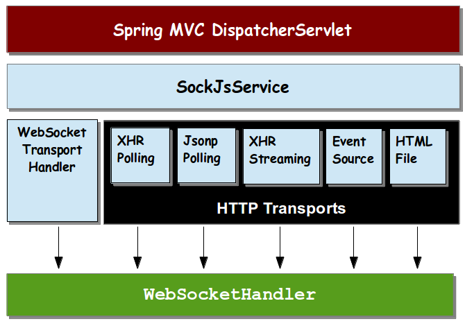

!SLIDE smaller bullets incremental
# SockJS

* Transparent fallback options
* For where WebSocket isn't supported or is precluded
* Emulate WebSocket API as close as possible
* At least one streaming protocol per browser, polling in old browsers or behind restrictive proxies

!SLIDE smaller bullets incremental
# SockJS [Protocol](https://github.com/sockjs/sockjs-protocol)

* Specified in the form of a (readable) [test suite](http://sockjs.github.io/sockjs-protocol/sockjs-protocol-0.3.3.html)
* Browser [JavaScript client](https://github.com/sockjs/sockjs-client) provided
* Wide range of [server implementations](https://github.com/sockjs/sockjs-client) available
* Now also in `spring-websocket`

!SLIDE smaller bullets incremental
# SockJS URL Scheme
   
        GET  /echo

        GET  /echo/info

        POST /echo/<server>/<session>/<transport>

!SLIDE smaller bullets incremental
# [SockJsService](https://github.com/SpringSource/spring-framework/blob/master/spring-websocket/src/main/java/org/springframework/web/socket/sockjs/SockJsService.java)

* Handles all requests at endpoint URL prefix for example `"/echo/**"`
* Determine transport to use from the URL `"/echo/{server}/{session}/xhr-polling"`
* Invoke `TransportHandler`
* Messages transparently delivered to/from `WebSocketHandler`

!SLIDE center

!SLIDE smaller bullets incremental
# Configure SockJS
  
    @@@ java

    @Configuration
    @EnableWebSocket
    public class WsConfig implements WebSocketConfigurer {

      @Override
      public void registerWebSocketHandlers(
            WebSocketHandlerRegistry registry) {

        registry.addHandler(myHandler(), "/echo");
      }

    }

!SLIDE smaller bullets incremental
# Configure SockJS
  
    @@@ java

    @Configuration
    @EnableWebSocket
    public class WsConfig implements WebSocketConfigurer {

      @Override
      public void registerWebSocketHandlers(
            WebSocketHandlerRegistry registry) {

        registry.addHandler(myHandler(), "/echo").withSockJS();
      }

    }

!SLIDE smaller
# WebSocket Handler
## (same as before)

  
    @@@ java

    import org.springframework.web.socket.*;

    public class MyHandler extends TextWebSocketHandlerAdapter {

      @Override
      public void handleTextMessage(WebSocketSession session,
          TextMessage message) throws Exception {

        session.sendMessage(message);

      }

    }

!SLIDE small bullets incremental
# Server Versions

* Spring's SockJS support will work on any __Servlet 3.0__ container
* Even where WebSocket not available yet
* Experimental [Netty support](https://github.com/wilkinsona/spring-websocket-netty-test)

!SLIDE smaller bullets incremental
# Detecting Client Disconnects

* No notification with Servlet 3 async support when a client does away
* See [SERVLET_SPEC-44](https://java.net/jira/b-rowse/SERVLET_SPEC-44) (and vote!)
* However `SockJsService` sends periodic heartbeats every 25 secs by default
* Session cleaned up on failure to send message

!SLIDE small
# WebSocket/SockJS Sample
  
## [https://github.com/rstoyanchev/](https://github.com/rstoyanchev/spring-websocket-test)
## [spring-websocket-test](https://github.com/rstoyanchev/spring-websocket-test)

!SLIDE small subsection
# Questions?

